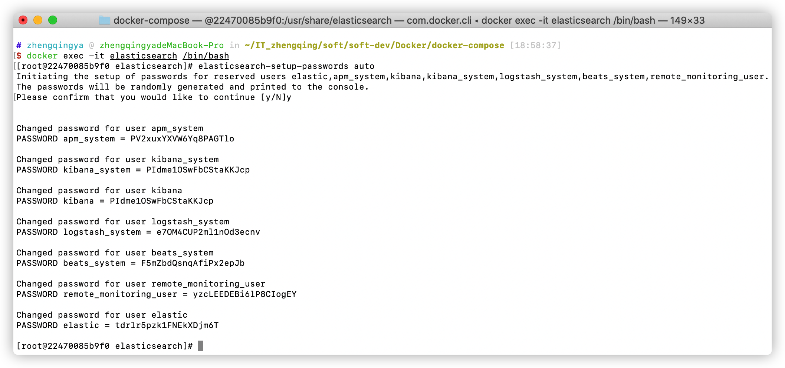
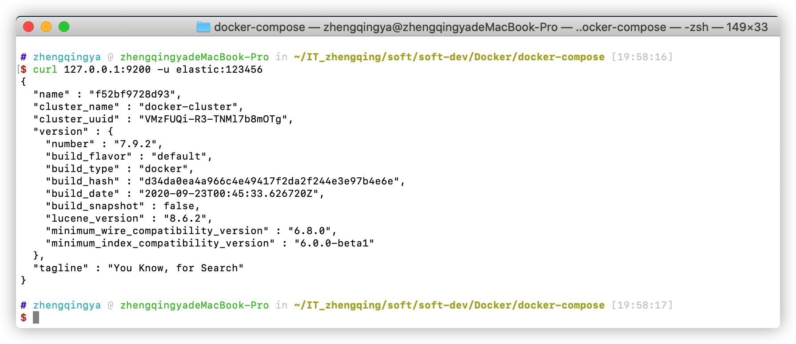

# Elasticsearch

### 部署

```shell
# 运行
docker-compose -f docker-compose-elasticsearch.yml -p elasticsearch up -d
# 运行后，给当前目录下所有文件赋予权限(读、写、执行)
#chmod -R 777 ./elasticsearch
```

1. ES访问地址：[`ip地址:9200`](http://www.zhengqingya.com:9200)
   默认账号密码：`elastic/123456`
2. kibana访问地址：[`ip地址:5601/app/dev_tools#/console`](http://www.zhengqingya.com:5601/app/dev_tools#/console)
   默认账号密码：`elastic/123456`

---

### 其它

#### 设置ES密码

```shell
# 进入容器
docker exec -it elasticsearch /bin/bash
# 设置密码-随机生成密码
# elasticsearch-setup-passwords auto
# 设置密码-手动设置密码
elasticsearch-setup-passwords interactive
# 访问
curl 127.0.0.1:9200 -u elastic:123456
```





#### 修改ES密码

```shell
# 修改elastic密码为123456 (注：执行命令时会让认证之前账号密码)
curl -H "Content-Type:application/json" -XPOST -u elastic 'http://127.0.0.1:9200/_xpack/security/user/elastic/_password' -d '{ "password" : "123456" }'
```

#### IK中文分词插件

下载地址 https://github.com/medcl/elasticsearch-analysis-ik/releases

#### 谷歌ES插件`Multi Elasticsearch Head`

https://chrome.google.com/webstore/detail/multi-elasticsearch-head/cpmmilfkofbeimbmgiclohpodggeheim?hl=zh-CN
