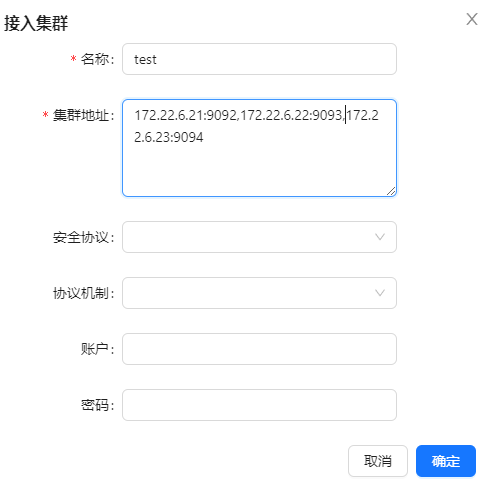

# Kafka

http://kafka.apache.org/

Kafka是一种基于分布式发布-订阅消息系统的开源软件。 其目标是提供高吞吐量、低延迟、可扩展性和容错能力。
Kafka中将消息存储在可配置数量的分区中，以便实现横向扩展，并且支持多个生产者和消费者，具有良好的可靠性保证机制。
除此之外，Kafka还支持数据复制、故障转移和离线数据处理等功能，并被广泛应用于网站活动跟踪、日志收集与分析、流式处理、消息队列等场景。

### 运行

kafka从2.8版本逐步取消依赖zookeeper，改用KRaft模式搭建集群

```shell
docker-compose -f docker-compose.yml up -d
```

### kafka-map可视化工具

https://github.com/dushixiang/kafka-map

- 访问：http://127.0.0.1:9006
- 账号密码：admin/123456


添加集群 eg: 172.22.6.21:9092,172.22.6.22:9093,172.22.6.23:9094



### java客户端连接

```yml
spring:
  kafka:
    bootstrap-servers: 127.0.0.1:9092,127.0.0.1:9093,127.0.0.1:9094 # 指定kafka server地址，集群（多个逗号分隔）
```

### 测试消费

```shell
# 创建主题
docker exec -it kafka-1 /opt/bitnami/kafka/bin/kafka-topics.sh --create --bootstrap-server kafka-1:9092 --topic my-topic --partitions 3 --replication-factor 2
# 控制台生产者
docker exec -it kafka-1 /opt/bitnami/kafka/bin/kafka-console-producer.sh --bootstrap-server kafka-1:9092 --topic my-topic
# 控制台消费者
docker exec -it kafka-1 /opt/bitnami/kafka/bin/kafka-console-consumer.sh --bootstrap-server kafka-1:9092 --topic my-topic
```


