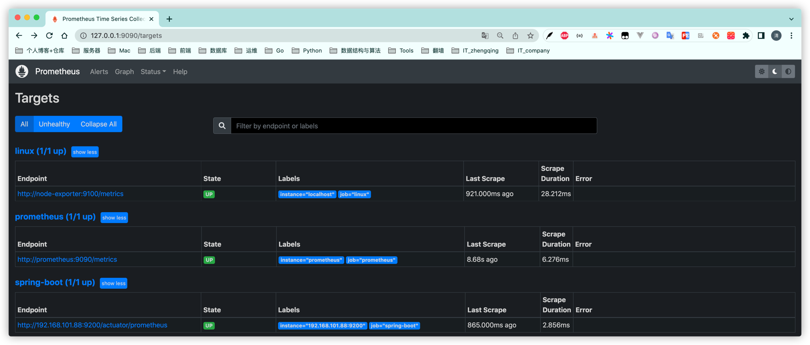
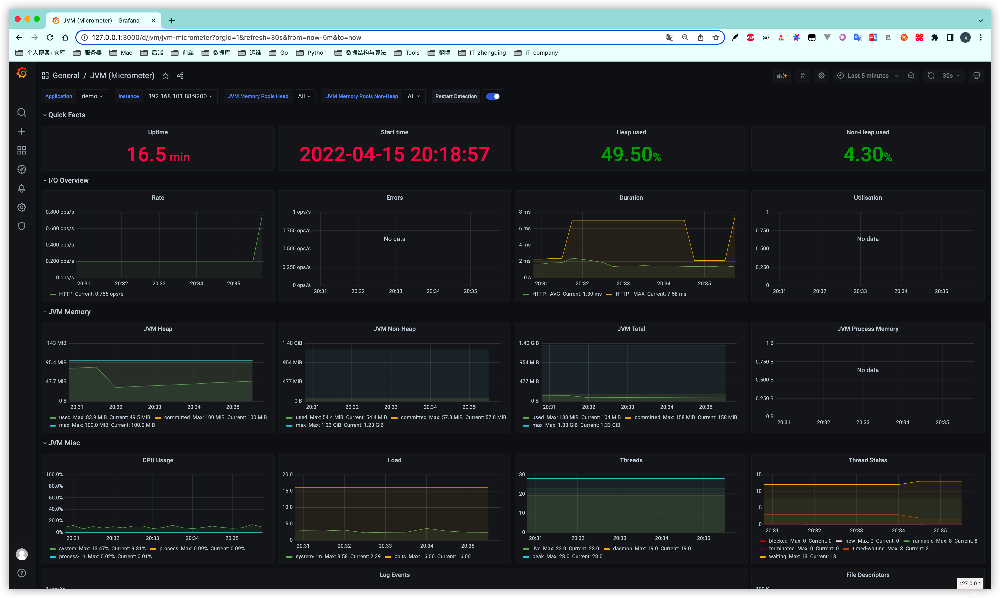

### Prometheus - 开源的系统监控和报警系统

> `docker-compose-prometheus.yml` 需修改grafana中配置的mysql连接信息
> `prometheus.yml` 自行配置

```shell
# 运行
docker-compose -f docker-compose-prometheus.yml -p prometheus up -d
# 查看grafana日志
docker logs -fn10 prometheus-grafana
```

1. grafana访问地址：[`http://ip地址:3000`](http://www.zhengqingya.com:3000)
   默认登录账号密码：`admin/admin`
2. prometheus访问地址: [`http://ip地址:9090`](http://www.zhengqingya.com:9090)
3. exporter访问地址: [`http://ip地址:9100/metrics`](http://www.zhengqingya.com:9100/metrics)





#### 其它

grafana面板资源 https://grafana.com/grafana/dashboards

node-exporter =》 https://grafana.com/grafana/dashboards/8919